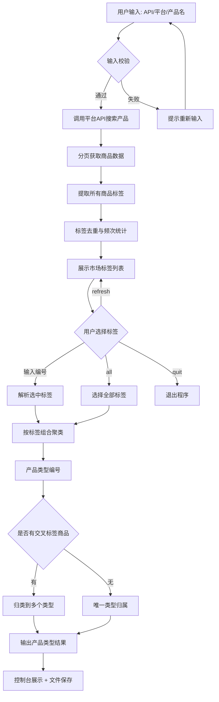
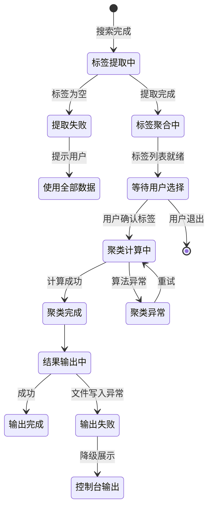

# 电商产品信息聚合与分析工具 PRD

---

## 🔷 0. PRD 类型判定

| 判定项 | 内容 |
|--------|------|
| **PRD 类型** | 🏗 **功能型** |
| **判定依据** | 从零开始构建一个全新的电商产品信息聚合与分析工具，包含多平台数据接入、标签提取与聚类、产品类型编号与输出、自定义筛选等核心功能 |
| **必须包含的结构** | 收益预估、验收标准、用户场景、辅助材料、流程图表 |
| **可简化的结构** | 埋点实验（非策略型，可简化但保留基础埋点） |

---

## 🔷 1. 项目背景与收益预估

### 1.1 需求简介

构建一个电商产品信息聚合与分析工具，用户输入 API、平台（淘宝/京东）和产品名称（如"空调"），自动抓取市面上所有相关产品信息，通过标签体系判断产品是否同质，对不同的产品类型进行编号，并输出结构化结果。过程中向用户展示该搜索词对应的所有市场标签，支持用户自定义选择以精细化筛选。

### 1.2 业务诉求

- 产品经理和运营人员需要快速了解某个品类下市场上有哪些不同类型的产品（如空调可分为"壁挂式空调""立柜式空调""中央空调""移动空调"等）
- 电商运营人员需要做竞品分析，但手动爬取和整理数据耗时耗力，且容易遗漏
- 缺乏统一的标签体系来区分产品类型，导致产品分析结果混乱、不可复用

### 1.3 收益预估（金字塔结构）

| 收益层级 | 内容 | 量化目标 |
|---------|------|---------|
| 1️⃣ **用户收益** | 用户无需手动逐页浏览和整理，一次搜索即可获得该品类下所有产品的类型结构、标签分类和编号信息 | 单次搜索时间从平均 **60 分钟** 缩短至 **5 分钟**，效率提升 **12 倍** |
| 2️⃣ **业务收益** | 电商运营/产品经理能够快速、全面、结构化地了解品类市场格局，辅助选品和竞品分析决策 | 预计品类分析覆盖率从人工的 **30%** 提升至 **95%** 以上 |
| 3️⃣ **商业收益** | 缩短市场调研周期，加快产品上线决策速度，减少因信息不全导致的错误选品 | 预计每个品类调研成本降低 **70%** |
| 4️⃣ **不做风险** | 持续依赖人工调研，效率低下且容易遗漏关键产品类型，在竞争中处于信息劣势，可能导致选品方向偏差 | — |

---

## 🔷 2. 业务流程简述

```
用户输入 API、平台、产品名称
        │
        ▼
  调用平台 API 搜索产品
        │
        ▼
  提取所有产品的标签信息
        │
        ▼
  展示该搜索词下所有市场标签（供用户自定义筛选）
        │
        ▼
  用户选择需要关注的标签
        │
        ▼
  基于标签聚类：判断产品是否相同（含相同标签的产品归为一类）
        │
        ▼
  对不同的产品类型进行编号
        │
        ▼
  输出编号和对应产品信息
```

---

## 🔷 3. 版本管理

### 3.1 PRD 文档修订记录

| 版本号 | 日期 | 修订人 | 修订内容 |
|--------|------|--------|---------|
| V1.0 | 2026-06-12 | Kira | 初稿 |

### 3.2 产品版本信息

| 项目 | 内容 |
|------|------|
| 产品名称 | 电商产品信息聚合与分析工具 |
| PRD 评审版本 | V1.0 |
| 目标上线版本 | V1.0 |
| 依赖模块 | Python 3.10+、淘宝开放平台 API、京东开放平台 API |
| 本期范围 | 核心功能：API 对接、产品搜索、标签提取与展示、标签自定义选择、产品类型聚类与编号、结果输出 |
| 后续范围 | 多平台扩展（拼多多、抖音电商等）、历史数据对比、趋势分析、报表导出 |

---

## 🔷 4. 系统关联与依赖

### 4.1 依赖模块列表

| 模块 | 说明 | 接口契约 | 优先级 |
|------|------|---------|--------|
| 淘宝开放平台 API | 淘宝/天猫商品搜索接口 | taobao.item.search / taobao.items.get | 高 |
| 京东开放平台 API | 京东商品搜索接口 | jd.item.search | 高 |
| 用户输入模块 | 接收用户输入的 API Key、平台选择、产品名称 | CLI 参数 / 配置文件 | 高 |
| 标签提取引擎 | 从商品标题、属性、描述中提取标签 | 内部模块 | 高 |
| 标签聚类引擎 | 基于标签相似度对产品进行聚类 | 内部模块 | 高 |
| 结果输出模块 | 输出编号、产品信息、标签信息 | 控制台 / 文件 | 高 |

### 4.2 数据流说明

```
用户输入（CLI/配置文件）
    │
    ▼
输入解析层 ──→ 平台 API 适配层 ──→ 淘宝 API / 京东 API
    │                              │
    │                              ▼
    │                         原始商品数据
    │                              │
    │                              ▼
    │                         标签提取引擎
    │                              │
    │                              ▼
    │                     所有市场标签展示 ←──→ 用户自定义选择标签
    │                              │
    │                              ▼
    │                         标签聚类引擎
    │                              │
    │                              ▼
    │                         产品类型编号
    │                              │
    │                              ▼
    └──────────────────────→ 结果输出（控制台/文件）
```

### 4.3 接口定义

#### 淘宝商品搜索接口（示例）

| 字段 | 类型 | 说明 |
|------|------|------|
| q | string | 搜索关键词（如"空调"） |
| page_size | int | 每页条数（最大 40） |
| page_no | int | 页码 |
| sort | string | 排序方式（如"default"/"price_asc"） |

#### 京东商品搜索接口（示例）

| 字段 | 类型 | 说明 |
|------|------|------|
| keyword | string | 搜索关键词 |
| page | int | 页码 |
| pagesize | int | 每页条数 |

### 4.4 耦合度评估

| 评估项 | 内容 |
|--------|------|
| 平台 API 耦合 | 通过适配器模式解耦，新增平台只需实现统一接口 |
| 标签提取耦合 | 标签提取算法独立于平台，输入标准化即可 |
| 结果输出耦合 | 输出格式与业务逻辑分离，支持多种输出格式扩展 |

---

## 🔸 5. 详细功能说明

### 5.1 用户输入模块

#### 位置
命令行入口，程序启动时交互式输入

#### 目标
接收用户输入的三个核心参数：API 凭证、平台选择、产品名称

#### 功能描述

**输入参数说明：**

| 参数 | 说明 | 是否必填 | 示例 |
|------|------|---------|------|
| 平台 | 选择搜索平台（淘宝/京东） | 必填 | 淘宝 |
| API Key / App Key | 平台 API 的访问凭证 | 必填 | 12345678 |
| API Secret | 平台 API 的密钥 | 必填 | abcdefghijk |
| 产品名称 | 要搜索的产品品类或关键词 | 必填 | 空调 |
| 搜索页数 | 要搜索的页数（可选，默认 5 页） | 可选 | 10 |
| 每页数量 | 每页返回的商品数（可选，默认 40） | 可选 | 40 |

**交互逻辑：**
- 支持交互式命令行输入，逐步提示用户填写
- 支持命令行参数直接传入（`--platform taobao --keyword 空调`）
- 支持配置文件方式（`config.json`）
- 输入校验：
  - 平台只能是"淘宝"或"京东"
  - API Key 和 Secret 不能为空
  - 产品名称不能为空
  - 搜索页数必须是正整数（默认 5）
  - 每页数量必须是 1-40 的正整数（淘宝限制）

#### 文本与数据展示
- 提示文案使用中文
- 输入错误的提示使用红色文字（如终端支持）

#### 异常处理
| 异常场景 | 处理方式 |
|---------|---------|
| 输入为空 | 重新提示输入，不允许跳过必填项 |
| 平台格式错误 | 提示"平台仅支持「淘宝」或「京东」，请重新输入" |
| API Key 格式异常 | 提示"API 凭证格式有误，请检查后重新输入" |

### 5.2 平台 API 对接与产品搜索模块

#### 位置
输入模块之后，自动执行

#### 目标
调用指定平台的商品搜索 API，获取原始商品数据

#### 功能描述

**淘宝 API 对接：**
- 调用 `taobao.item.search` 接口
- 支持分页获取（按用户指定的页数和每页数量）
- 每次请求间隔 ≥ 500ms（防止触发限流）

**京东 API 对接：**
- 调用京东商品搜索接口
- 支持分页获取
- 每次请求间隔 ≥ 500ms

**数据字段提取（标准化输出）：**

| 字段 | 说明 | 淘宝字段 | 京东字段 |
|------|------|---------|---------|
| 商品 ID | 唯一标识 | num_iid | sku_id |
| 商品标题 | 产品名称 | title | name |
| 价格 | 当前售价 | price | price |
| 月销量 | 月度销售量 | volume | sales_count |
| 店铺名称 | 卖家店铺名 | nick | shop_name |
| 商品标签 | 从属性/标题中提取 | props_name / title | attribute / title |
| 商品链接 | 详情页 URL | detail_url | link |

#### 加载态
- 搜索启动时显示"正在搜索「{产品名称}」，共搜索 {页数} 页..."
- 每完成一页显示"第 {N}/{总页数} 页搜索完成，已获取 {累计条数} 条商品数据"
- 搜索完成显示"搜索完成，共获取 {总条数} 条商品数据"

#### 错误态
| 错误场景 | 处理方式 |
|---------|---------|
| API 凭证无效 | 提示"API 凭证验证失败，请检查 Key 和 Secret 是否正确" |
| 接口调用超时（8 秒无响应） | 提示"接口请求超时，正在进行第 {N} 次重试（共 3 次）" |
| 接口返回错误码 | 根据平台错误码输出中文提示 |
| 3 次重试均失败 | 提示"接口连续 3 次请求失败，请检查网络或 API 状态后重试"，终止流程 |

#### 边界数值
| 参数 | 数值 |
|------|------|
| 请求间隔 | 500ms（防限流） |
| 超时阈值 | 8 秒 |
| 最大重试次数 | 3 次 |
| 每页最大条数 | 40 条（淘宝限制） |
| 最大搜索页数 | 50 页（防止请求量过大） |
| 单次搜索最大商品数 | 2000 条 |

### 5.3 标签提取与展示模块

#### 位置
产品搜索完成后，进入标签提取流程

#### 目标
从所有搜索结果中提取所有产品的标签，统计并展示给用户，让用户了解该品类下的市场标签分布

#### 功能描述

**标签提取来源（优先级从高到低）：**

| 来源 | 说明 | 示例（空调） |
|------|------|------------|
| 商品属性参数 | 平台商品属性中的关键值 | 匹数（1.5匹/2匹/3匹）、类型（壁挂式/立柜式） |
| 商品标题关键词 | 标题中频繁出现的特征词 | 变频、冷暖、智能、自清洁 |
| 商品类目路径 | 平台类目体系中的细分 | 家用电器 > 空调 > 壁挂式空调 |
| 描述/详情关键词 | 详情中提取的特征 | 静音、节能、一级能效 |

**标签去重与统计：**

```
输入：所有商品的原始标签列表
处理：
  1. 同义词合并（如"变频"和"变频空调"合并为"变频"）
  2. 去除非特征词（如"正品""包邮""官方"等通用词）
  3. 按出现频次排序
输出：去重后的标签列表 + 每个标签的出现频次
```

**展示格式：**

```
═══ 空调 —— 市场标签统计 ═══
共获取 200 条商品数据，提取 15 个标签

  #1  壁挂式        出现 85 次  ████████████████████
  #2  立柜式        出现 60 次  ██████████████
  #3  变频          出现 120 次 ██████████████████████████████
  #4  定频          出现 30 次  ███████
  #5  1.5匹         出现 70 次  █████████████████
  #6  2匹           出现 25 次  ██████
  #7  3匹           出现 20 次  █████
  #8  一级能效      出现 55 次  █████████████
  #9  智能控制      出现 40 次  ██████████
  #10 自清洁        出现 35 次  ████████
  #11 冷暖型        出现 90 次  █████████████████████
  #12 单冷型        出现 15 次  ████
  #13 中央空调      出现 10 次  ███
  #14 移动空调      出现 8 次   ██
  #15 新风空调      出现 5 次   █

输入标签编号（用逗号分隔，如 1,3,5）来选择要关注的标签
或输入 "all" 选择全部，输入 "quit" 退出：
```

#### 交互逻辑
- 展示所有标签及其出现频次（带柱状图可视化）
- 用户输入编号组合选择需要关注的标签（如 `1,3,5,8,10`）
- 支持输入 `all` 选择全部标签
- 支持输入 `quit` 退出程序
- 支持输入 `refresh` 重新展示标签列表
- 支持输入标签名称（部分匹配）进行标签搜索过滤

#### 文本与数据展示
- 标签按频次从高到低排序
- 柱状图使用终端字符（`█`）展示相对比例
- 每个标签附带出现频次和百分比
- 无标签时提示"未提取到有效标签，将使用全部商品数据"

#### 异常处理
| 异常场景 | 处理方式 |
|---------|---------|
| 用户输入空值 | 重新提示输入 |
| 用户输入无效编号 | 提示"编号 {N} 无效，请输入有效编号，用逗号分隔" |
| 所有商品均无有效标签 | 提示"未提取到有效标签，将使用全部商品数据进行分析" |

### 5.4 标签聚类与产品类型判别模块

#### 位置
用户选择标签后，自动执行

#### 目标
根据用户选择的标签，对所有商品进行聚类，将具有相同标签组合的产品归为同一类型，从而识别出该品类下有哪些不同类型的产品

#### 功能描述

**聚类算法逻辑：**

```
输入：商品列表 + 用户选择的标签集合
处理：
  1. 对每个商品，提取其拥有的选中标签的集合（去重）
  2. 将标签集合相同的商品归为一组（产品类型）
  3. 对每组内的商品信息进行聚合（合并标题、统计价格区间、汇总销量等）
  4. 按每组商品数量从多到少排序
输出：不同类型的产品列表（带编号）
```

**示例（空调场景）：**

用户选择了标签：壁挂式、立柜式、变频、定频、1.5匹、2匹、3匹、一级能效

聚类结果：
- **类型 #1**：壁挂式 + 变频 + 1.5匹 + 一级能效（45 个商品）
- **类型 #2**：壁挂式 + 变频 + 1.5匹 + 三级能效（25 个商品）
- **类型 #3**：立柜式 + 变频 + 3匹 + 一级能效（20 个商品）
- **类型 #4**：壁挂式 + 定频 + 1.5匹（15 个商品）
- **类型 #5**：立柜式 + 定频 + 2匹（10 个商品）

#### 交互逻辑
- 自动执行，无需用户干预
- 如果聚类结果中某类型的商品数量过少（如仅有 1-2 个），在结果中标为"低样本类型"

#### 异常处理
| 异常场景 | 处理方式 |
|---------|---------|
| 聚类后仅有一类 | 提示"所有商品特征高度一致，仅识别到 1 种产品类型"，正常输出 |
| 聚类后类型过多（>30） | 提示"检测到 {N} 种产品类型，建议缩小标签选择范围以获得更精准的结果" |
| 部分商品无匹配标签 | 归入"其他"类别，在结果末尾展示 |

### 5.5 结果输出模块

#### 位置
聚类完成后，自动输出

#### 目标
以清晰的结构化格式输出不同类型产品的编号、特征描述和典型商品信息

#### 功能描述

**输出格式（控制台）：**

```
═══ 空调 —— 产品类型分析结果 ═══
共 200 条商品，聚类为 5 种产品类型
筛选标签：壁挂式、立柜式、变频、定频、1.5匹、2匹、3匹、一级能效

━━━━━━━━━━━━━━━━━━━━━━━━━━━━━━━━━━━━━━━━━
类型 #1（45 个商品）
  特征：壁挂式 | 变频 | 1.5匹 | 一级能效
  价格区间：¥2,499 - ¥3,899
  平均价格：¥3,199
  代表商品：格力云佳 1.5匹 新一级能效 变频冷暖 壁挂式空调
  店铺：格力官方旗舰店
━━━━━━━━━━━━━━━━━━━━━━━━━━━━━━━━━━━━━━━━━
类型 #2（25 个商品）
  特征：壁挂式 | 变频 | 1.5匹 | 三级能效
  价格区间：¥1,899 - ¥2,699
  平均价格：¥2,299
  代表商品：美的极酷 1.5匹 变频冷暖 壁挂式空调
  店铺：美的官方旗舰店
━━━━━━━━━━━━━━━━━━━━━━━━━━━━━━━━━━━━━━━━━
...

═══ 结果已保存至 output/空调_20260612_143000.json ═══
```

**输出选项：**

| 输出方式 | 说明 |
|---------|------|
| 控制台输出 | 默认输出，带格式和美化的文本 |
| JSON 文件输出 | 保存完整结构化数据到 `output/{产品名}_{时间戳}.json` |
| CSV 文件输出 | 保存表格化数据到 `output/{产品名}_{时间戳}.csv` |
| (可选) 简略模式 | 仅输出编号和类型名称，不展示详细商品信息 |

**JSON 输出格式示例：**

```json
{
  "meta": {
    "platform": "淘宝",
    "keyword": "空调",
    "total_products": 200,
    "total_types": 5,
    "selected_tags": ["壁挂式", "立柜式", "变频", "定频", "1.5匹", "2匹", "3匹", "一级能效"],
    "search_time": "2026-06-12 14:30:00"
  },
  "product_types": [
    {
      "type_id": 1,
      "product_count": 45,
      "tags": ["壁挂式", "变频", "1.5匹", "一级能效"],
      "price_range": {"min": 2499, "max": 3899, "avg": 3199},
      "representative_product": {
        "title": "格力云佳 1.5匹 新一级能效 变频冷暖 壁挂式空调",
        "shop": "格力官方旗舰店",
        "price": 3199,
        "url": "https://..."
      }
    }
  ]
}
```

#### 文本与数据展示
- 类型编号使用 `类型 #N` 格式
- 特征标签使用 `|` 分隔
- 价格区间使用 `¥` 货币符号
- 代表商品展示标题、店铺、价格
- 输出文件路径使用相对路径展示

#### 异常处理
| 异常场景 | 处理方式 |
|---------|---------|
| 输出目录不存在 | 自动创建 `output/` 目录 |
| 文件写入失败 | 提示"结果文件保存失败，错误信息：{详情}，请在控制台查看输出" |
| 无符合条件的产品 | 提示"无符合所选标签条件的产品，请扩大标签选择范围" |

---

## 🔸 6. 流程与状态图表

### 6.1 业务流程图（Mermaid）



### 6.2 标签聚类状态机图（Mermaid）



### 6.3 多平台适配泳道图（PlantUML）

```
@startuml
|用户|
start
:输入API/平台/产品名;

|输入解析层|
:解析并校验输入参数;

|淘宝适配器|
if (平台 == 淘宝) then (是)
  :调用 taobao.item.search;
  :处理淘宝响应数据;
  :输出标准化商品数据;
else (否)
  |京东适配器|
  :调用 JD 商品搜索接口;
  :处理京东响应数据;
  :输出标准化商品数据;
endif

|标签引擎|
:从标准商品数据中提取标签;
:标签去重与统计;
:展示标签列表;

|用户|
:选择标签;

|聚类引擎|
:基于标签组合聚类;
:生成产品类型编号;

|输出模块|
:输出结果;

stop
@enduml
```

---

## 🔷 7. 数据埋点与实验设计（简化版）

> 说明：本期为功能型 PRD，埋点设计作为可选部分，仅保留核心功能埋点。

### 7.1 埋点设计

| 事件 | 触发条件 | 上报字段 |
|------|---------|---------|
| search_start | 用户发起搜索请求 | 平台、关键词、搜索页数、每页条数 |
| search_complete | 搜索完成（成功） | 平台、关键词、总获取商品数、搜索耗时 |
| search_fail | 搜索失败 | 平台、关键词、失败原因、错误码 |
| tags_displayed | 标签列表展示给用户 | 标签总数、搜索商品总数 |
| tags_selected | 用户选择标签 | 选中的标签列表、标签数量 |
| cluster_complete | 聚类完成 | 产品类型数量、总商品数 |
| result_export | 结果导出 | 导出格式（JSON/CSV）、产品类型数 |

---

## 🔷 8. 验收标准

| # | 测试场景 | 前置条件 | 操作 | 期望结果 | 判定 |
|---|---------|---------|------|---------|------|
| 1 | 正常搜索流程（淘宝） | 有效的淘宝 API Key 和 Secret | 输入"淘宝"、API 凭证、"空调"，默认搜索 5 页 | 成功搜索并获取商品数据，展示标签列表 | 商品数 > 0，标签列表完整 |
| 2 | 正常搜索流程（京东） | 有效的京东 API Key 和 Secret | 输入"京东"、API 凭证、"空调"，默认搜索 5 页 | 成功搜索并获取商品数据，展示标签列表 | 商品数 > 0，标签列表完整 |
| 3 | 标签选择与聚类 | 搜索完成，标签列表已展示 | 输入标签编号如 "1,3,5,8" | 按所选标签组合聚类，输出产品类型编号和详情 | 聚类结果合理，编号连续 |
| 4 | 选择全部标签 | 标签列表已展示 | 输入 "all" | 使用全部标签进行聚类 | 聚类结果包含所有标签组合 |
| 5 | 搜索无结果 | 关键词为不存在的品类 | 输入"不存在xyz123" | 提示"未搜索到相关商品数据" | 提示语正确，程序不崩溃 |
| 6 | 无效 API 凭证 | 输入错误的 API Key/Secret | 输入随便填的 API 凭证 | 提示"API 凭证验证失败" | 提示语正确，程序终止或等待重新输入 |
| 7 | 无效标签编号 | 标签列表展示时 | 输入 "999" | 提示"编号 999 无效" | 提示语正确，重新等待输入 |
| 8 | 空输入 | 处于输入提示状态 | 直接回车（空输入） | 重新提示输入 | 不允许跳过必填项 |
| 9 | JSON 文件输出 | 搜索和聚类完成 | 自动保存结果 | output/ 目录生成 JSON 文件，格式符合规范 | 文件存在且 JSON 解析正确 |
| 10 | 超时重试 | 网络不稳定 | 运行搜索 | 超时后自动重试，3 次均失败则提示 | 重试间隔合理，提示语清晰 |
| 11 | 聚类结果为单类型 | 所有商品标签高度一致 | 搜索一个极窄品类 | 提示"仅识别到 1 种产品类型"，正常输出 | 提示语正确，输出合理 |
| 12 | 用户中途退出 | 任意输入阶段 | 输入 "quit" | 程序正常退出 | 无异常报错 |

---

## 🔷 9. 辅助材料清单

| 审查项 | 适用场景 | 材料要求 | 状态 |
|--------|---------|---------|------|
| 🧩 流程图 | 核心业务流程 | Mermaid 流程图（§6.1） | ✓ 已完成 |
| 🧩 状态机图 | 标签聚类状态流转 | Mermaid 状态图（§6.2） | ✓ 已完成 |
| 🧩 泳道图 | 多平台适配流程 | PlantUML 泳道图（§6.3） | ✓ 已完成 |
| 📐 线框图 | CLI 交互界面 | 终端交互示意（见 §5.3 展示格式） | ✓ 已包含 |
| 📐 数据结构 | 输出格式 | JSON Schema（见 §5.5） | ✓ 已定义 |

---

## 附录 A：CLI 命令参考

```bash
# 交互式模式（推荐新手使用）
python product_monster.py

# 命令行参数模式
python product_monster.py --platform taobao --appkey YOUR_KEY --secret YOUR_SECRET --keyword 空调 --pages 5 --pagesize 40

# 配置文件模式
python product_monster.py --config config.json

# 简略输出模式
python product_monster.py --brief
```

## 附录 B：配置文件示例（config.json）

```json
{
  "platform": "taobao",
  "appkey": "your_app_key_here",
  "secret": "your_secret_here",
  "keyword": "空调",
  "pages": 5,
  "page_size": 40,
  "output_format": "json",
  "output_dir": "./output"
}